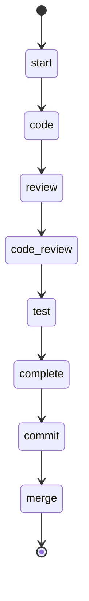

# Wingman vs Gas Town: Tradeoffs for Pi Integration

**Date**: 2026-02-10
**Context**: Evaluating whether to repurpose Wingman code as a pi extension, embed Gas Town, or take a lighter approach
**Related**: IDEA-000002, [gastown analysis](./2026-02-10-gastown-analysis.md)

---

## Wingman: What It Is

Wingman is your own workflow orchestration framework for AI coding agents (~24K LoC TypeScript, ~14K LoC tests, 167 commits). It executes **state-machine workflows defined in Mermaid diagrams** embedded in Markdown files with YAML frontmatter.

### Architecture

```
CLI (commander) → WorkflowExecutionManager → WorkflowEngine → ActionExecutor → CodingAgentManager → Agent (Claude/Qwen/Codex)
                                                              → ToolManager → MCP Servers
```

### Core Abstractions

| Concept | Implementation |
|---------|---------------|
| **Workflow** | Markdown file with Mermaid `stateDiagram-v2` + YAML frontmatter + `## Actions` section |
| **States** | Nodes in the Mermaid diagram (start, end, intermediate) |
| **Transitions** | Edges with optional conditions (`result.content.contains("YES")`) |
| **Actions** | Typed: `prompt`, `shell`, `log`, `variable`, `tool`, `workflow` (recursive) |
| **Conditions** | AST-based safe expression evaluator (no `eval`) with helpers like `.contains()`, `.matches()` |
| **Guards** | Post-execution tool-call verification (e.g., "test prompt must have called `notify_create`") |
| **Persistence** | JSON files: run state, events, output logs |
| **Agents** | Claude Code, Qwen Code, OpenAI Codex — spawned as CLI subprocesses |

### Example: The `do_issue` Workflow



Each state maps to an action (prompt, sub-workflow, shell command). Transitions are deterministic based on Mermaid edges + condition expressions. The engine follows the state machine mechanically — the agent only controls what happens *within* each step.

### Key Strengths

1. **Workflows as data** — Mermaid diagrams are both human-readable docs AND executable specs. Clever dual-purpose design.
2. **Deterministic flow control** — The engine, not the agent, decides what step runs next. Agent output is evaluated against conditions to choose transitions.
3. **Tool-call guards** — Post-action verification that specific tools were called (e.g., "test must call `notify_create`", "issue/complete must call `issues_mark_complete`"). This is exactly the pattern needed for review enforcement.
4. **Recursive workflows** — `run workflow "tdd"` nests sub-workflows, enabling composition.
5. **Safe condition evaluator** — AST-based expression evaluation, no `eval()` or `new Function()` (for the condition path; variable manager still has a `new Function()` fallback).
6. **Substantial test suite** — 53 test files, 13.7K LoC of tests, good coverage of engine routing, condition evaluation, guard violations.
7. **Abort mechanism** — File-based abort signaling between processes.
8. **MCP integration** — Already uses MCP for tool servers.
9. **Loop safety** — Configurable iteration limits, backoff delays, execution timeouts per state.

### Key Weaknesses

1. **Agent context is thrown away** — `formatInstructionForClaude()` discards conversation context. Each prompt step is effectively a fresh agent with no memory of prior steps. Only explicit variables carry state forward.
2. **Single-process model** — Designed for one agent at a time. No parallel execution of steps. The `maxConcurrent: 3` in config refers to workflow runs, not parallel steps within a run.
3. **Subprocess agent model** — Spawns Claude/Qwen as CLI subprocesses, sends prompt to stdin, reads stdout. This is incompatible with pi's subagent model (which has depth limits, background tasks, structured dispatch).
4. **No inter-agent communication** — No mail system, no handoffs, no event bus. Each workflow is a single linear pipeline.
5. **Hardcoded paths** — User-specific paths in agent configuration.
6. **Shelved project** — Last meaningful commit was the codex integration. Multiple worktrees suggest it was put aside mid-feature.
7. **Missing resumability** — `resumeWorkflow()` exists but only for "running" status. No crash recovery or checkpoint-based resumption from arbitrary steps.
8. **Storage is in-process only** — Write locks protect within a single process but not across processes. No shared state between concurrent workflow instances.

---

## Gas Town: What It Is (Summary)

Full multi-agent orchestration: 20-30 concurrent AI agents with persistent identity, git-backed state, inter-agent mail, merge queue, watchdog chain, and TOML-defined workflow formulas. Written in Go (~50K+ LoC). See [gastown analysis](./2026-02-10-gastown-analysis.md) for full details.

---

## Head-to-Head Comparison

| Dimension | Wingman | Gas Town |
|-----------|---------|----------|
| **Language** | TypeScript (same as pi) | Go (foreign to pi) |
| **Workflow format** | Mermaid + Markdown | TOML formulas |
| **Flow control** | Deterministic state machine | Deterministic DAG (ReadySteps) |
| **Agent model** | CLI subprocess (claude/codex) | Claude Code sessions in tmux |
| **Parallelism** | None (sequential steps only) | Full (convoy legs, parallel batches) |
| **Inter-agent comms** | None | Mail system + hooks |
| **State persistence** | JSON files (basic) | Git-backed beads DB (robust) |
| **Crash recovery** | Minimal | Full (propulsion principle + watchdogs) |
| **Review enforcement** | Tool-call guards (post-hoc) | Separate reviewer role + formula |
| **Scope** | Single-workflow executor | Full team orchestration |
| **Integration effort** | Medium (TS, reuse engine) | High (Go binary, different paradigm) |
| **LOC to adapt** | ~24K TS (much reusable) | ~50K+ Go (mostly not reusable) |
| **Tests** | Good (53 files, 14K LoC) | Good |
| **Maturity** | Prototype (shelved) | Active development |
| **Pi compatibility** | High (TS, MCP already) | Low (Go, tmux-centric) |

---

## Option Analysis

### Option 1: Repurpose Wingman's Workflow Engine as a Pi Extension

**What you'd take:**
- `WorkflowEngine` + `WorkflowParser` + `ConditionEvaluator` (~3K LoC core)
- The Mermaid-based workflow definition format
- The tool-call guard pattern
- The JSON storage layer

**What you'd rewrite:**
- `ActionExecutor` → Replace subprocess agent model with pi's `subagent()` calls
- `CodingAgentManager` → Not needed (pi manages agents)
- Add pi extension wrapper exposing `workflow_run`, `workflow_status` tools
- Add step-level state persistence for crash recovery

**Integration surface:**
```
pi extension (TS)
  ├── workflow_define(path)     — parse a Mermaid workflow .md
  ├── workflow_run(name, vars)  — start execution
  ├── workflow_status(runId)    — check progress
  ├── workflow_resume(runId)    — resume from last checkpoint
  └── step_complete(runId, stepId, result) — mark step done
```

The coordinator agent would call `workflow_run("implement-with-review")` and the engine would mechanically drive: implement → verify_commit → spec_review → quality_review → fix_loop → done. Each step dispatches a pi subagent. Transitions are data, not prompt instructions.

**Effort**: ~2-3 weeks to extract, adapt, and integrate.

**Pros:**
- TypeScript — same language as pi, can be a native extension
- You wrote it — you understand the design decisions and can evolve it
- Workflow format (Mermaid) is elegant and human-readable
- Tool-call guards solve the "did the agent actually do the review?" problem
- Condition evaluator is standalone, safe, well-tested
- Already has MCP integration
- Can keep workflows in `.wrangler/workflows/` alongside existing config

**Cons:**
- Single-threaded execution model — no parallel step dispatch without significant rework
- Agent context issue — each step is a fresh agent, no conversation continuity
- Needs crash recovery work — current resumability is insufficient
- Still fundamentally a prompt sequencer — it drives agents through steps but doesn't have Gas Town's event-driven architecture where completion *triggers* the next phase
- No watchdog / missed-step detection

### Option 2: Embed Gas Town

**What "embed" means:**
- Install `gt` binary alongside pi
- Use Gas Town's formula system for workflow definitions
- Use its beads system for tracking
- Use its polecat/witness/refinery model for role separation

**Effort**: 1-2 weeks to set up, ongoing complexity managing two systems.

**Pros:**
- Mature, comprehensive orchestration with all the hard problems solved
- Event-driven architecture — reviews are triggered, not remembered
- Watchdog chain catches missed steps
- Built-in merge queue, conflict resolution, escalation
- Multi-agent parallelism is native
- Active development by Steve Yegge

**Cons:**
- **Go binary** — foreign to your TS/pi ecosystem. Can't extend it natively.
- **Tmux-centric** — Assumes agents run in tmux panes. Pi uses subagents, not tmux sessions.
- **Claude Code-native** — Built for Claude Code specifically. Would need adaptation for pi's agent model.
- **Massive surface area** — You'd adopt the whole system (beads, mail, hooks, roles, formulas, molecules, daemon, boot, deacon, witness, refinery). That's a LOT of concepts.
- **Two sources of truth** — Gas Town has beads, pi has wrangler issues. Would need reconciliation.
- **Opinionated about git** — Assumes polecats work in worktrees managed by gt, not by pi's worktree skills.
- **Dependency risk** — You'd depend on someone else's framework for your core workflow. If the design diverges from your needs, you're stuck.
- **Learning curve** — The concept density is very high (molecules, wisps, digests, propulsion, hooks, convoys, etc.)

### Option 3: Hybrid — Take Gas Town's Ideas, Implement in Wingman's Engine

**The insight:** Gas Town's *architecture* is brilliant, but its *implementation* is in the wrong language. Wingman's *implementation* is in the right language, but its *architecture* lacks Gas Town's key innovations.

**What you'd do:**
1. Start with Wingman's workflow engine (parser, condition evaluator, state machine)
2. Add Gas Town's **event-driven triggers** — step completion writes state file, trigger script checks state and dispatches next step
3. Add Gas Town's **ReadySteps pattern** — compute what can run from the dependency graph + completion set, don't rely on agent following a linear list
4. Add Gas Town's **guard → fix loop** — if review fails, the workflow mechanically spawns a fix step and re-reviews (like Refinery creating conflict-resolution tasks)
5. Add a **lightweight watchdog** — a simple script that checks "are there steps in 'ready' state that haven't started within N minutes?"

**Skip:**
- Gas Town's full role system (Witness, Refinery, Deacon) — overkill for pi
- Gas Town's mail system — pi has subagents, not tmux sessions
- Gas Town's beads DB — wrangler issues are sufficient
- Gas Town's molecule/wisp/digest taxonomy — complexity not needed yet

**Effort**: ~2-3 weeks for the engine, +1 week per Gas Town pattern you add.

**Pros:**
- Best of both worlds — Wingman's TS engine + Gas Town's architectural patterns
- Incremental — start with the workflow engine, add deterministic triggers, add watchdog later
- Stays in your ecosystem — TS, pi extension, wrangler issues
- You own all the code — no external dependency
- The v1 can be very small (just the engine + one review-gate workflow)

**Cons:**
- Most work up front (but also most control)
- Risk of under-implementing — tempting to skip the hard parts (watchdog, crash recovery)

### Option 4: Minimal — State File + Trigger Scripts (No Engine)

From the gastown analysis — the lightest lift.

**What you'd do:**
1. JSON state file per-issue: `{"state": "implemented", "review_attempts": 0, ...}`
2. Shell script `review-gate.sh` that:
   - Reads state
   - If `implemented` → dispatches review explorer, parses output
   - If `SPEC_FAIL` → updates state to `review_failed`, returns fix instructions
   - If `SPEC_PASS` → updates state to `spec_passed`, dispatches quality review
   - If all pass → updates state to `reviewed`
3. Coordinator calls `review-gate.sh` after each implementer — script decides what's next

**Effort**: ~3-5 days.

**Pros:**
- Minimal code — a shell script + JSON state, maybe 200 lines
- Works today — no new dependencies, no engine to build
- Deterministic — the script can't forget, can't skip
- Easy to debug — state is a JSON file, script is bash
- Follows the AGENTS.md principle: "deterministic mechanical steps should migrate to scripts"

**Cons:**
- No formal workflow definition — the state machine is implicit in bash if/else
- No resumability across sessions — if coordinator dies, state file is there but nothing auto-restarts
- No composition — each gate script is standalone, can't compose workflows
- Will hit limits fast — as you add more gates, the bash becomes unwieldy
- No parallel execution

---

## Recommendation

**Start with Option 4 (state file + trigger scripts) as v1, designed to evolve into Option 3.**

Rationale:
1. **Option 4 solves the immediate problem** — review triggers become deterministic, today, with 200 lines of bash
2. **The JSON state file format you design for Option 4 becomes the persistence layer for Option 3** — no throwaway work
3. **The trigger script logic maps directly to workflow transitions** — when you later define these as Mermaid workflows in Wingman's engine, the behavior is identical but now composable and formally defined
4. **You can extract Wingman's engine incrementally** — start with the condition evaluator (standalone, well-tested), then the parser, then the engine loop
5. **Gas Town's patterns inform both** — ReadySteps logic can be a bash function in v1 and a proper engine in v2

### Concrete v1 Scope

```
scripts/review-gate.sh
  - Input: worktree path, issue ID, PR number
  - Reads: .wrangler/tracking/{issue-id}.json
  - State machine: implemented → spec_reviewing → spec_passed/spec_failed → quality_reviewing → reviewed/quality_failed → fixing → re_reviewing
  - Each state transition: updates JSON, returns instruction to coordinator
  - Max retry tracking built into state

scripts/verify-completion.sh  (already exists in implementing-specs)
  - Enhanced: writes to state JSON instead of just returning

.wrangler/tracking/{issue-id}.json
  - {"state": "...", "spec_review_attempts": 0, "quality_review_attempts": 0, "last_review_feedback": "...", "commit_hash": "..."}
```

The coordinator's Phase 4 Step 6 simplifies from 100+ lines of review instructions to:

```bash
RESULT=$(scripts/review-gate.sh {WORKTREE} {ISSUE_ID} {PR_NUMBER})
# RESULT is one of: DISPATCH_SPEC_REVIEW, DISPATCH_FIX, DISPATCH_QUALITY_REVIEW, REVIEWED, ESCALATE
```

The script handles ALL the logic: "was spec review done? did it pass? how many retries? should we fix or escalate?" The coordinator just follows the instruction.

### Evolution Path

```
v1 (now):     State file + bash scripts → deterministic review triggers
v2 (later):   Extract Wingman engine → formal Mermaid workflows replace bash
v3 (someday): Add Gas Town patterns → ReadySteps, parallel dispatch, watchdog
```

Each step is additive. No throwaway work.
