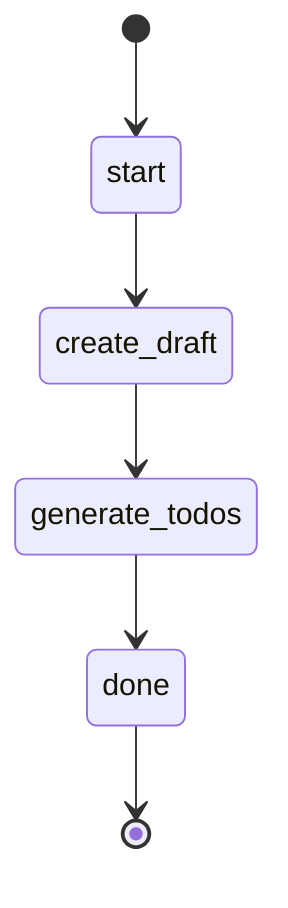

# Memo: Swiss Army Hammer Fork as Wrangler Orchestration Layer

**Date:** 2026-02-11
**Author:** Claude (research synthesis)
**Context:** Evaluating whether forking Swiss Army Hammer (SAH) and embedding it in wrangler as an MCP server could provide simple workflow orchestration as an alternative to Spec 44's Agent SDK pipeline.

---

## The Question

Spec 44 proposes a TypeScript pipeline using the Claude Agent SDK where code controls phase sequencing via separate `query()` calls. SAH is a Rust monorepo that already has workflow orchestration, prompt templating, and an MCP server. Could forking SAH and embedding it in wrangler give us the orchestration we need with less custom code?

Three specific sub-questions:
1. Could SAH prompts/workflows be moved to a more accessible place in wrangler's directory?
2. Could the main Claude Code agent effectively run SAH commands?
3. How does this compare to Spec 44's proposal?

---

## Finding 1: What SAH Actually Is

SAH is a substantial Rust monorepo (41 crates, v0.6.1) built for autonomous AI development. Its architecture:

**Workflow Engine:** State machines defined as Markdown files with YAML frontmatter and Mermaid `stateDiagram-v2` blocks. States transition based on JavaScript expression conditions. Eight action types: PromptAction (call LLM), ShellAction, LogAction, SetVariableAction, WaitAction, SubWorkflowAction, JsSetAction, AbortAction. Max 1000 transitions per run. Resumable from checkpoints via `.swissarmyhammer/runs/`.

**Prompt System:** Liquid-templated Markdown files with YAML frontmatter. Parameters with types (string, boolean, number, choice, multi_choice). Template context resolution: action args > workflow vars > parameter defaults > config vars > environment vars. Partials for reuse.

**MCP Server:** 25+ tools (file operations, shell, git, treesitter, kanban, web, JS eval). Runs via `sah serve` on stdio or HTTP.

**Agent Integration:** Uses Agent Client Protocol (ACP) to communicate with Claude. Supports modes (planner, implementer, reviewer, tester, general-purpose) that set system prompts.

**Key design decisions:** Everything is Markdown. No databases. Git-friendly. Liquid templating everywhere.

---

## Finding 2: SAH's Workflow Engine vs What We Need

Here's a concrete SAH workflow definition:

```markdown
---
name: plan
title: Planning Workflow
mode: planner
parameters:
  - name: plan_filename
    required: true
---



## Actions
- start: Log "Making the plan..."
- create_draft: Execute prompt "create-draft-plan" with plan_filename="{{ plan_filename }}"
- generate_todos: Execute prompt "generate-todos"
- done: Log "Plan ready"
```

**What this gives you:** Declarative step definitions, automatic sequencing, conditional transitions via JS expressions (`success == true`, `num_retries < 3`), variable passing between steps, and resumability.

**What this doesn't give you (that Spec 44 needs):**

| Requirement | SAH Workflow | Spec 44 Pipeline |
|------------|-------------|-----------------|
| Structured output validation | No -- prompt responses are unstructured text | Zod schemas validate every phase's output |
| Tool restrictions per phase | No -- all MCP tools available to all states | `allowedTools` per `query()` call (reviewer is read-only) |
| Model selection per phase | Mode sets system prompt only | Different model per phase (Haiku for analysis, Sonnet for implementation) |
| In-process hooks | No -- workflows execute in separate process | `canUseTool` callback, PreToolUse/PostToolUse hooks |
| Budget/turn limits per phase | No per-state budget controls | `maxBudgetUsd`, `maxTurns` per `query()` |
| Context isolation between phases | Partial -- variables carry forward but LLM context resets per prompt | Full -- each `query()` starts fresh subprocess |

The gap is fundamental: SAH workflows orchestrate *prompts* (text in, text out). Spec 44 orchestrates *agent sessions* (structured input, tool-restricted execution, validated structured output). These are different levels of abstraction.

---

## Finding 3: The "MCP Server Orchestrating LLM Calls" Problem

The proposed architecture: embed SAH as a wrangler MCP server, then have Claude Code call SAH tools to run workflows that themselves invoke Claude.

**This creates a recursive architecture:**

```
Claude Code session
  -> calls wrangler MCP tool "run_workflow"
    -> SAH workflow executor starts
      -> PromptAction shells out to `claude -p`
        -> new Claude Code subprocess starts
          -> connects to MCP servers (including wrangler?)
            -> potential infinite recursion
```

**Specific concerns:**

1. **Recursion risk.** If the inner `claude -p` has access to the same MCP servers, it could call `run_workflow` again. This must be explicitly guarded.

2. **Process tree depth.** Outer Claude Code -> MCP server -> SAH Rust binary -> `claude -p` subprocess -> inner MCP servers. Each layer adds IPC overhead and debugging complexity.

3. **Credential distribution.** Each `claude -p` subprocess needs API key access. The MCP server process must have the key in its environment.

4. **Loss of human-in-the-loop.** The MCP Sampling specification requires human approval. Shelling out to `claude -p` from an MCP server bypasses this entirely -- the server autonomously invokes full agentic sessions.

5. **Context passing.** SAH passes context between states via workflow variables (string key-value pairs). There's no equivalent of Spec 44's Zod-validated structured output between phases. You'd be parsing stdout from `claude -p` as strings.

**The MCP spec does have an answer for this** -- the Sampling capability lets MCP servers request LLM completions from the client. But that's fundamentally different from spawning new agentic sessions. Sampling gives you one completion; Spec 44 needs full multi-turn agent sessions with tool access.

---

## Finding 4: The Embedding/Forking Calculus

**What would forking SAH actually involve:**

SAH is 41 Rust crates. To embed it in wrangler (a TypeScript/Node project with an existing MCP server), you would need to either:

**Option A: Fork the whole Rust binary and shell out to it.**
- Ship a compiled `sah` binary alongside wrangler's MCP server
- Call it via `child_process.spawn('sah', ['flow', 'workflow-name'])`
- Parse its stdout for results
- Maintenance burden: you now maintain a Rust codebase alongside TypeScript

**Option B: Port the workflow engine to TypeScript.**
- Extract the state machine executor, Mermaid parser, action system, and Liquid templating
- Reimplement in TypeScript
- Integrate with wrangler's existing MCP server
- Significant effort, but then it's native to the stack

**Option C: Use SAH's workflow definitions but build a new executor.**
- Keep the Markdown+YAML+Mermaid workflow format (it's well-designed)
- Build a TypeScript executor that reads these files
- Use Agent SDK `query()` instead of ACP for LLM calls
- Best of both worlds? Or worst -- maintaining a custom executor for a format you don't control?

**The critical question:** What does SAH give you that the Agent SDK doesn't?

SAH's differentiating value is: (a) Mermaid-based visual workflow definitions, (b) Liquid-templated prompts, (c) resumable state machine execution. Let's evaluate each:

| SAH Capability | Agent SDK Equivalent | Delta |
|---------------|---------------------|-------|
| Mermaid workflow definitions | TypeScript code (for loops, if/else) | Readability vs type safety tradeoff |
| Liquid prompt templates | Template literals or `.md` files loaded at runtime | Trivial to replicate |
| Resumable execution | Checkpoint/restore in Spec 44 (session state serialization) | Spec 44 has this planned |
| 25+ MCP tools | Claude Code's built-in tools + wrangler MCP | Already available |
| Mode system (planner/implementer/reviewer) | Spec 44's agent definitions with per-phase prompts | Same concept, different format |

**The honest assessment:** SAH's core value for our use case is the Mermaid workflow definition format. Everything else is either equivalent to what we already have or inferior to what Spec 44 proposes. And the Mermaid format, while visually appealing, trades compile-time type safety for readability -- the opposite of what you want for a deterministic pipeline where "the LLM can't skip phases."

---

## Finding 5: Performance Parity -- Both Approaches Hit the Same Bottleneck

A critical finding from the research: `query()` and `claude -p` are the same thing under the hood. Both spawn a Claude Code subprocess with approximately 12 seconds of startup overhead per invocation.

| Metric | Agent SDK `query()` | SAH `claude -p` |
|--------|-------------------|-----------------|
| Cold start | ~12s | ~12s |
| Context isolation | Yes (separate subprocess) | Yes (separate subprocess) |
| Structured output | Native JSON Schema | Parse stdout |
| Tool restriction | Native `allowedTools` | CLI `--allowedTools` flag |
| Warm mode | Streaming input (~2-3s subsequent) but shared context | N/A |

The performance bottleneck is identical. SAH adds no advantage here. What it adds is process overhead: the SAH binary itself must start, parse the workflow, and set up its execution context before it even calls `claude -p`.

For a 7-phase pipeline with ~5 tasks each going through implement/review/fix, expect 15+ subprocess invocations = ~3 minutes of pure startup overhead with either approach. This is tolerable for pipelines running 30-60 minutes total.

---

## Finding 6: What Anthropic Recommends

Anthropic's engineering blog advocates: "Use agents within steps, but use code for sequencing between steps."

The pattern they endorse:
- **Code** controls the pipeline: sequencing, branching, retry logic, error handling
- **Agents** execute within each step: tool use, reasoning, implementation
- **Structured outputs** pass validated data between steps

This maps exactly to Spec 44. It explicitly does not map to SAH's approach, where a YAML/Mermaid file defines sequencing and a runtime interpreter executes it. The interpreter is the code doing the sequencing -- you've just added an indirection layer.

**The interpreter problem:** A declarative workflow definition requires an interpreter. That interpreter is imperative code. You are not avoiding imperative code; you are hiding it behind an abstraction layer that adds indirection without adding capability. With Spec 44, the orchestrator IS the code. With SAH, the orchestrator is an interpreter reading a format -- and you need to maintain both the format and the interpreter.

---

## Finding 7: What You'd Actually Gain From SAH

After thorough analysis, the concrete gains from embedding SAH:

**Gains:**
1. Visual workflow definitions (Mermaid diagrams) -- nice for documentation, not for determinism
2. Liquid templating for prompts -- trivially replicable with template literals
3. A battle-tested state machine executor -- but in Rust, not your stack

**Costs:**
1. 41-crate Rust monorepo to maintain (or shell out to binary)
2. No structured output validation between phases
3. No per-phase tool restriction, model selection, or budget limits
4. MCP-as-orchestrator recursion risk
5. Additional process overhead (SAH binary startup + subprocess spawn)
6. Two different languages/ecosystems to maintain
7. Fork drift: every SAH upstream change must be manually cherry-picked
8. SAH's ACP integration doesn't match the Agent SDK's `query()` API

**What you'd still need to build regardless:**
- Zod schemas for structured inter-phase output
- Per-phase tool restriction logic
- Per-phase model selection
- Review/fix loop with retry limits
- Checkpoint/resume logic
- Issue creation/tracking integration
- PR creation and publish logic

In other words, embedding SAH gives you a workflow definition format and a state machine executor, but you'd still need to build all of Spec 44's phase-specific logic. SAH becomes a complex dependency for what amounts to a `for` loop with a `switch` statement.

---

## Recommendation

**Don't fork SAH. Implement Spec 44 as designed.**

The reasoning:

1. **SAH solves a different problem.** SAH is designed for human-supervised autonomous development sessions ("write specs, not code"). Spec 44 is a deterministic pipeline where code enforces quality gates. These are architecturally incompatible goals.

2. **The abstraction adds complexity, not capability.** SAH's workflow engine is a runtime interpreter for YAML/Mermaid definitions. For a pipeline that must be deterministic and type-safe, an interpreter adds a failure mode (interpretation errors) without adding a capability (the Agent SDK provides everything SAH would provide, plus structured output, tool restriction, and budget control).

3. **Maintenance cost is disproportionate.** Forking a 41-crate Rust monorepo to use its workflow engine -- when you need TypeScript + Agent SDK anyway -- creates a permanent maintenance burden for minimal value.

4. **The prompt templating idea has merit, but doesn't require SAH.** If you want to define agent personas/prompts as Markdown files rather than inline TypeScript strings, that's a good idea. You can do it with a `prompts/` directory in `.wrangler/` and a simple file loader. No Liquid templating engine required.

**However:** SAH's Mermaid workflow visualization is genuinely useful for *documentation*. Consider generating a Mermaid diagram from the Spec 44 TypeScript pipeline as documentation output, rather than using Mermaid as the source of truth for execution.

---

## Comparison: All Three Options Side by Side

| Dimension | Spec 44 (Agent SDK) | GitHub-Native (Actions) | SAH Fork (Embedded) |
|-----------|-------------------|----------------------|-------------------|
| Deterministic sequencing | Code-controlled, guaranteed | Workflow-level, mostly guaranteed | Interpreter-dependent, YAML-defined |
| Structured output | Zod-validated per phase | JSON via job outputs (no Zod) | Parse stdout (no validation) |
| Tool restriction per phase | Native `allowedTools` | Not available per-job | Not available per-state |
| Model selection per phase | Native `model` option | Not available per-job | Possible via CLI flags |
| In-session review loop | Yes (subagent model) | No (separate job) | No (separate subprocess) |
| Retry logic | TypeScript loops | Label-based tracking | Mermaid transitions |
| Resumability | Planned (checkpoint) | Not built-in | Built-in (SAH runs/) |
| Testing | Standard unit tests, mock `query()` | Test YAML + runners | Test interpreter + YAML |
| Maintenance | TypeScript only | Single YAML file | TypeScript + Rust monorepo |
| Anthropic alignment | Matches recommended pattern | Complementary (output gate) | Novel, undocumented pattern |
| Context preservation | Full within each phase | Lost between jobs | Partial (string variables only) |
| Audit trail | In-session logs | PR comments, check annotations | SAH run logs |
| Works without GitHub | Yes | No | Yes |

---

## The Bottom Line

The three options occupy different parts of the solution space:

- **Spec 44** solves the hard problem: deterministic execution with validated inter-phase communication and per-phase tool/model control. This is the pipeline.

- **GitHub Actions** solves the visibility problem: enforceable merge gates, audit trails, and team-facing review workflows. This is the verification layer.

- **SAH** solves a different problem entirely: human-supervised autonomous development sessions with visual workflow definitions. Its workflow engine is architecturally mismatched with the deterministic pipeline requirements.

**The recommended architecture remains:** Spec 44 as the pipeline + GitHub Actions as the external verification gate (per the first memo's recommendation). SAH's contributions to this architecture are cosmetic (Mermaid diagrams, Liquid templates) rather than structural.

---

## Sources

Research conducted via parallel subagent investigations covering:
- Full SAH codebase analysis (41 crates, workflow engine, prompt system, MCP server, agent integration)
- SAH workflow/prompt definition format analysis (Mermaid parsing, action types, Liquid templating, parameter system)
- Claude Agent SDK `query()` vs CLI `claude -p` performance comparison
- MCP-as-orchestrator pattern analysis (Sampling spec, recursion risks, process tree depth)
- Declarative vs imperative workflow orchestration (Microsoft Agent Framework, CrewAI, LangGraph comparisons)
- Fork vs depend analysis (fork drift, maintenance burden, security implications)
- Anthropic's recommended orchestration patterns (engineering blog, Agent SDK documentation)
