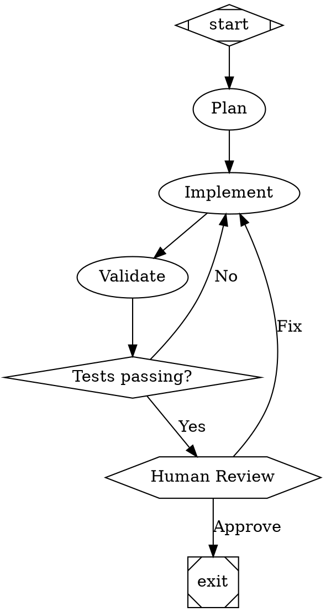

# Beyond Spec-Driven Development: A Research Memo

**Date**: February 9, 2026  
**Purpose**: Identify cutting-edge practices, tools, and architectural patterns to accelerate AI-assisted development velocity beyond the current spec-driven workflow.

---

## Table of Contents

1. [Executive Summary](#executive-summary)
2. [The Core Insight: Backpressure Engineering](#the-core-insight-backpressure-engineering)
3. [Current State Assessment](#current-state-assessment)
4. [Tier 1: Quick Wins (Days)](#tier-1-quick-wins-days)
5. [Tier 2: Medium Investment (1-2 Weeks)](#tier-2-medium-investment-1-2-weeks)
6. [Tier 3: Longer-Term (Weeks to Months)](#tier-3-longer-term-weeks-to-months)
7. [Recommended Sequencing](#recommended-sequencing)
8. [The Key Mental Shift](#the-key-mental-shift)
9. [Appendix A: Key Projects & Repos](#appendix-a-key-projects--repos)
10. [Appendix B: Articles, Essays & Workflows](#appendix-b-articles-essays--workflows)
11. [Appendix C: Techniques Glossary](#appendix-c-techniques-glossary)
12. [Appendix D: The Spec-Driven Development Ecosystem](#appendix-d-the-spec-driven-development-ecosystem)
13. [Appendix E: Autonomous Loop Patterns](#appendix-e-autonomous-loop-patterns)

---

## Executive Summary

The frontier of AI-assisted development has moved decisively beyond "spec → agent → human review loop." The leading practitioners — StrongDM's Software Factory, Jesse Vincent's Superpowers (48k GitHub stars), Steve Yegge's VC agent colony — are converging on a model where **humans never write or review code**. They write specs, design validation harnesses, and engineer automated feedback loops ("backpressure") so agents self-correct without human intervention.

The current pi/wrangler workflow is solidly in the Level 3-4 range of the emerging maturity model, with spec-driven development, subagent dispatch, TDD enforcement, code review, and git worktree isolation already in place. The gap to the frontier is primarily about:

1. **Eliminating human-in-the-loop for correction** — automating the feedback that currently requires you to say "that's wrong, try again"
2. **Parallelizing agent work** — running multiple agents simultaneously on independent tasks
3. **Shifting to non-interactive execution** — queuing fully-specified work that runs without supervision
4. **Hardening validation** — moving from tests (which agents can game) to scenarios and holdout sets

This memo breaks down actionable improvements into three tiers by investment level, with specific tools, repos, and implementation guidance for each.

---

## The Core Insight: Backpressure Engineering

The framing that unifies all the cutting-edge work comes from [banay.me](https://banay.me/dont-waste-your-backpressure/):

> _"If you're directly responsible for checking each line of code produced is syntactically valid, then that's time taken away from thinking about the larger goals. You're going to struggle to derive more leverage because you are caught up in trivial changes."_

**Backpressure** is any automated feedback mechanism that tells an agent it made a mistake — without requiring a human to deliver that feedback. Compilers, type checkers, test suites, linters, and rendered UI previews are all forms of backpressure.

> _"I think that the payoff of investing into higher quality testing is growing massively, and an increasing part of engineering will involve designing and building back pressure in order to scale the rate at which contributions from agents can be accepted."_

The practical question for every workflow step is: **"Am I giving the agent feedback that a machine could give instead?"** Every "yes" is a backpressure gap — an opportunity to automate yourself out of the loop.

StrongDM pushes this to its logical conclusion:

> _"Code must not be written by humans. Code must not be reviewed by humans."_
>
> _"If you haven't spent at least $1,000 on tokens today per human engineer, your software factory has room for improvement."_

This is the target. Not because humans add no value, but because human attention should be spent on spec design, scenario curation, and backpressure engineering — not on line-by-line code correction.

### The Backpressure Hierarchy

From cheapest/fastest to most expensive/comprehensive:

| Level | Feedback Source                    | Latency  | What It Catches                      |
| ----- | ---------------------------------- | -------- | ------------------------------------ |
| 1     | Type checker / compiler            | Seconds  | Syntax, type errors, missing imports |
| 2     | Linter / formatter                 | Seconds  | Style violations, common mistakes    |
| 3     | Unit tests (TDD)                   | Seconds  | Behavioral regressions, logic errors |
| 4     | AI pre-commit review               | ~30s     | Standards drift, pattern violations  |
| 5     | Spec compliance review             | ~1-2 min | Over/under-building, spec drift      |
| 6     | Integration tests                  | Minutes  | Cross-component issues               |
| 7     | Scenario validation (LLM-as-judge) | Minutes  | End-to-end behavioral correctness    |
| 8     | Digital twin testing               | Minutes  | External dependency edge cases       |

The current workflow covers levels 1-3 well. The gap is primarily at levels 4-8.

---

## Current State Assessment

### What's Already Strong

- **Spec-driven development** with structured specifications and issue tracking
- **TDD enforcement** via the `practicing-tdd` skill (RED-GREEN-REFACTOR cycle)
- **Subagent dispatch** for implementation tasks
- **Code review** via subagents with severity-based blocking
- **Git worktree isolation** for parallel development
- **Self-healing verification** (VERIFY phase with up to 3 remediation iterations)
- **Governance framework** (constitution, roadmap, specifications)

### Where Time Is Still Lost

1. **Bug-fixing back-and-forth**: When an agent produces incorrect code, you're still manually identifying what's wrong and telling it to fix it
2. **Sequential execution**: Issues are implemented one at a time even when independent
3. **Single-pass review**: One review pass catches fewer issues than two specialized passes
4. **Interactive supervision**: You watch agents work instead of batching fully-specified work
5. **Test gaming**: Agents can rewrite tests to match incorrect code
6. **Context degradation**: Later tasks in a sequence get worse results as context fills up

---

## Tier 1: Quick Wins (Days)

These can be instrumented with the existing pi/wrangler setup within a few focused sessions.

### 1. AI-Powered Pre-Commit Quality Gate

**What**: Add AI-based code review as an automated git hook that runs on every commit.

**Tools**:

- [prek](https://github.com/j178/prek) (⭐ 6.0k) — Rust-based `pre-commit` replacement, single binary, no Python dependency. Used by CPython, FastAPI, Apache Airflow.
- [Gentleman Guardian Angel (GGA)](https://github.com/Gentleman-Programming/gentleman-guardian-angel) (⭐ 558) — Pure bash, zero dependencies. Runs staged files through any LLM against your project's rules file on every commit.
- [Anthropic's claude-code-security-review](https://github.com/anthropics/claude-code-security-review) (⭐ 3.0k) — GitHub Action for AI security review of code changes.

**Why**: The `setting-up-git-hooks` skill currently sets up test/lint hooks but not AI review. GGA adds a fast backpressure layer that catches standards drift, naming convention violations, and architectural anti-patterns before they reach you.

**How it works**:

```
git commit → prek runs lint/format hooks → GGA runs AI review against AGENTS.md/constitution
→ Pass: commit proceeds
→ Fail: agent gets feedback, self-corrects, re-commits
```

**Implementation**:

- Install prek: `brew install prek`
- Install GGA: `brew install gentleman-programming/tap/gga`
- Run `gga init` in project to create config
- Configure rules file pointing to project constitution/coding standards
- Update `setting-up-git-hooks` skill template to include GGA

**Effort**: ~2 hours. **Impact**: Catches style/standards drift automatically.

### 2. Two-Stage Review (Spec Compliance + Code Quality)

**What**: Split the single review pass into two specialized subagent reviews.

**Source**: Jesse Vincent's [Superpowers](https://github.com/obra/superpowers) (⭐ 48.4k) `subagent-driven-development` skill.

**Why**: A single reviewer tries to evaluate two different things at once: "Does this match the spec?" and "Is this well-built?" These require different perspectives. Splitting them catches a common failure mode: code that's clean but doesn't match the spec, or matches the spec but has quality issues.

**The pattern**:

1. **Spec compliance reviewer**: "Does this implement exactly what was specified? Nothing extra, nothing missing?" (catches over-building and under-building)
2. **Code quality reviewer**: "Given that it matches the spec, is the implementation well-structured?" (catches technical debt)

**From the Superpowers workflow**:

> _"Spec reviewer: ❌ Issues: Missing: Progress reporting (spec says 'report every 100 items'). Extra: Added --json flag (not requested)."_
>
> _"Implementer fixes issues → Spec reviewer reviews again → ✅ Spec compliant now"_
>
> _"Code reviewer: Issues (Important): Magic number (100) → Implementer: Extracted PROGRESS_INTERVAL constant → Code reviewer: ✅ Approved"_

**Implementation**: Update `reviewing-code` and `implementing-issue` skills to dispatch two sequential reviewer subagents. Superpowers repo has ready-made prompt templates.

**Effort**: ~3 hours. **Impact**: Significantly reduces spec drift and "back and forth on bugs."

### 3. Parallel Subagent Dispatch for Independent Issues

**What**: When the EXECUTE phase has multiple independent issues, dispatch them simultaneously.

**Why**: The current `implementing-specs` skill dispatches subagents one at a time. Pi already supports parallel subagent dispatch (4 background task slots). For independent issues (no shared file edits), parallelization is free velocity.

**Prerequisites**: Issues must be classified as independent (no overlapping file edits, no data dependencies). An LLM can do this classification by reading issue descriptions.

**Implementation**:

- In EXECUTE phase, add a classification step: "Which of these issues are independent?"
- Dispatch independent issues in parallel batches using `subagent` parallel mode
- After parallel batch completes, run any dependent issues sequentially
- Run integration tests after merging parallel results

**Effort**: ~4 hours. **Impact**: 3-4x speedup on typical specs with independent tasks.

### 4. Pyramid Summaries for Context Management

**What**: Multi-level reversible summarization of completed work.

**Source**: StrongDM's [Techniques](https://factory.strongdm.ai/techniques):

> _"Pyramid Summaries: Reversible summarization at multiple zoom levels. Compress context without losing the ability to expand back to full detail."_

**Why**: When subagents work on later issues, they don't need full detail about completed issues — just enough to understand the current state. But they might need to drill into specifics for dependencies.

**Implementation**: After each issue completes, generate a 3-level summary:

- **L1** (1 line): `"Added JWT authentication middleware to Express routes"`
- **L2** (paragraph): Key decisions, file paths modified, API contracts established
- **L3** (full): Complete implementation details, test coverage, commit hashes

Pass L1+L2 to subsequent subagents as "completed work context." L3 available on demand via file read.

**Effort**: ~3 hours. **Impact**: Better context quality for later tasks, fewer hallucinations from context overflow.

---

## Tier 2: Medium Investment (1-2 Weeks)

### 5. Shift Work — Non-Interactive Agent Runs

**What**: Separate interactive design work from fully-specified implementation work.

**Source**: StrongDM's [Techniques](https://factory.strongdm.ai/techniques):

> _"Shift Work: Separate interactive work from fully specified work. When intent is complete (specs, tests, existing apps), an agent can run end-to-end without back-and-forth."_

**Why**: The current flow still has you watching agents work. The goal is to queue up fully-specified work that runs while you're designing the next spec or sleeping.

**Reference tools**:

- [Ralphy](https://github.com/michaelshimeles/ralphy) (⭐ 2.3k) — Autonomous AI coding loop. Runs any agent on tasks until done. Supports PRD files, parallel execution with isolated worktrees, and GitHub Issues as task source. The simplest "just run it" tool.
- [Ralph](https://github.com/iannuttall/ralph) (⭐ 707) — Minimal file-based agent loop. Each iteration starts fresh, reads on-disk state. `.ralph/guardrails.md` accumulates lessons learned. Stale story detection and auto-reopen.
- [CodeMachine](https://github.com/moazbuilds/CodeMachine-CLI) (⭐ 2.3k) — "The workflow lives in your head. CodeMachine lets you capture that workflow and run it again." Multi-agent orchestration with parallel execution.
- [Emdash](https://github.com/generalaction/emdash) (⭐ 1.2k, YC W26) — Run multiple coding agents in parallel across providers, each in its own worktree.
- [CCPM](https://github.com/automazeio/ccpm) (⭐ 7.2k) — PRD → Epic → Task decomposition → Parallel execution via GitHub Issues. The most complete "production-grade" workflow for Claude Code.

**Implementation**:

- Build a `batch-runner` skill that takes a list of issue IDs
- Runs them headlessly via pi background subagents
- Each iteration uses file-based state (Ralph pattern) — fresh context, filesystem as memory
- Accumulated guardrails file captures lessons across iterations
- Writes structured results to a report file
- You review the batch output asynchronously
- Failures get triaged: auto-fixable vs. needs-human

**Effort**: ~1 week. **Impact**: Design specs during the day, agents implement overnight.

### 6. Competing Proposals (Speculative Execution)

**What**: For critical/ambiguous tasks, spawn 2-3 agents with different approaches and select the best.

**Source**: The banay.me article hints at this pattern:

> _"Keep pulling the LLM slot machine lever until the result you have can be trusted."_

**Why**: Instead of one agent trying → failing → trying again (serial), run three agents in parallel with different strategies. The "judge" agent evaluates all proposals against the spec and selects the winner. This trades tokens for quality and speed.

**Similar patterns in the wild**:

- [VC](https://github.com/steveyegge/vc) (⭐ 296) — Steve Yegge's AI-supervised issue workflow: "AI Assessment: strategy, steps, risks → Execute via agent → AI Analysis → Quality gates → AI decides: close, partial, or blocked"
- [OpenAgentsControl](https://github.com/darrenhinde/OpenAgentsControl) (⭐ 1.9k) — "Approval Gates: Propose → Approve → Execute" pattern with plan-first development

**Implementation**:

- New skill: `competing-proposals`
- Given a spec, LLM generates 2-3 different implementation strategies
- Each dispatched as a parallel subagent in a separate worktree
- "Judge" subagent evaluates all approaches against spec + quality criteria
- Winning approach gets merged; losers get discarded

**Effort**: ~1 week. **Impact**: Higher quality for complex/ambiguous tasks.

### 7. Self-Healing CI Loop

**What**: When tests fail in hooks or CI, automatically spawn an agent to fix them before interrupting you.

**Why**: Currently if a pre-push hook fails, it blocks and you investigate. Instead: hook failure → agent reads error → attempts fix → re-runs tests → only bothers you if it can't self-heal within N attempts.

**Implementation**:

- Modify git hooks to capture failure output to a temp file
- On failure, invoke pi in headless mode with the failure context
- Agent reads error, proposes fix, runs tests
- If green after ≤3 attempts: auto-commit the fix
- If still failing: generate diagnostic report and notify you

**Effort**: ~1 week. **Impact**: Dramatically reduces interrupt frequency.

### 8. Gene Transfusion (Pattern Propagation)

**What**: Move working patterns between codebases by pointing agents at concrete exemplars.

**Source**: StrongDM's [Techniques](https://factory.strongdm.ai/techniques):

> _"Gene Transfusion: Move working patterns between codebases by pointing agents at concrete exemplars. A solution paired with a good reference can be reproduced in new contexts."_

**Why**: When you have a well-implemented feature in one project, agents should replicate that pattern in another project without you explaining it from scratch. This is compounding knowledge.

**Implementation**:

- Create a `patterns/` directory in governance
- Each pattern: exemplar code + explanation + constraints
- New skill `apply-pattern` takes pattern reference + target context
- Agent reads exemplar, adapts to target project's conventions
- Patterns grow organically as good implementations are captured

**Effort**: ~3 days. **Impact**: Compounding returns as pattern library grows.

### 9. The Filesystem as Agent Memory

**What**: Use structured files and directories as persistent memory for agents.

**Source**: StrongDM's [Techniques](https://factory.strongdm.ai/techniques):

> _"The Filesystem: Models can navigate repositories quickly and adjust their own context by reading and writing files. Directories, indexes, and on-disk state become a practical memory substrate."_

**Why**: Agents lose context between sessions. Rather than relying on conversation history, use structured files that agents can read/write to maintain state across sessions.

**Reference implementations**:

- **Ralph's guardrails pattern**: `.ralph/guardrails.md` accumulates "signs" (lessons learned) across iterations. Each iteration reads this file, avoiding repeated mistakes.
- **Pro-Workflow's self-correction**: SQLite-backed memory with FTS5 search. `/replay` surfaces past learnings. Correction heatmap shows where agents make the most mistakes.
- **Mimir** (⭐ 230): Full semantic vector search over local files via MCP. Agents can search their own prior outputs semantically.
- **CCPM's context priming**: `.claude/context/` files loaded at session start to prime agent with project knowledge.

**Implementation**:

- `.wrangler/memory/` directory with structured index files
- Agents write decision logs, context summaries, and learned constraints
- Guardrails file accumulates lessons: "Never use X pattern because Y"
- New sessions start by reading the relevant memory files
- Consider SQLite for searchable memory (Pro-Workflow approach)
- This is already partially done with tracking files; formalize it

**Effort**: ~3 days. **Impact**: Better cross-session continuity. Agents stop repeating mistakes.

---

## Tier 3: Longer-Term (Weeks to Months)

### 10. Scenarios Over Tests (Holdout Validation)

**What**: Separate "tests" (in the codebase, visible to agents) from "scenarios" (outside the codebase, used as holdout validation).

**Source**: StrongDM's [Story](https://factory.strongdm.ai/):

> _"The word 'test' has proven insufficient and ambiguous. A test, stored in the codebase, can be lazily rewritten to match the code. The code could be rewritten to trivially pass the test."_
>
> _"We repurposed the word scenario to represent an end-to-end 'user story', often stored outside the codebase (similar to a 'holdout' set in model training), which could be intuitively understood and flexibly validated by an LLM."_

**Why**: TDD is necessary but not sufficient. Agents can game tests — `return true` passes a narrow test. Scenarios stored outside the codebase act as a holdout validation set that agents can't optimize against during implementation.

**Key concept — "Satisfaction"**:

> _"We transitioned from boolean definitions of success ('the test suite is green') to a probabilistic and empirical one. We use the term satisfaction to quantify this validation: of all the observed trajectories through all the scenarios, what fraction of them likely satisfy the user?"_

**Implementation**:

- When writing specs, also write scenarios (user journey descriptions)
- Store in `.wrangler/scenarios/` (separate from source code)
- After implementation, run scenarios as validation (LLM-as-judge)
- Track satisfaction rate (% of scenarios that pass)
- Threshold: e.g., 90% satisfaction required for merge

**Effort**: ~2 weeks. **Impact**: Much harder for agents to game; catches real behavioral regressions.

### 11. Digital Twin Universe

**What**: Behavioral clones of critical third-party dependencies for high-throughput testing.

**Source**: StrongDM's [Story](https://factory.strongdm.ai/):

> _"The Digital Twin Universe is our answer: behavioral clones of the third-party services our software depends on. We built twins of Okta, Jira, Slack, Google Docs, Google Drive, and Google Sheets, replicating their APIs, edge cases, and observable behaviors."_
>
> _"With the DTU, we can validate at volumes and rates far exceeding production limits. We can test failure modes that would be dangerous or impossible against live services."_

**The economics argument**:

> _"Creating a high fidelity clone of a significant SaaS application was always possible, but never economically feasible. Generations of engineers may have wanted a full in-memory replica of their CRM to test against, but self-censored the proposal to build it. Those of us building software factories must practice a deliberate naivete: finding and removing the habits, conventions, and constraints of Software 1.0."_

**Why**: External dependencies are the biggest source of non-determinism in testing. Digital twins make tests fast, deterministic, and parallelizable.

**Implementation**: For each critical dependency, have an agent build a behavioral clone (mock server replicating API surface + edge cases). Store as test infrastructure. Agents themselves can build these.

**Effort**: ~2-4 weeks per major dependency. **Impact**: 100x test throughput, deterministic scenarios.

### 12. Full Pipeline Orchestration (Attractor-Style)

**What**: DAG-based workflow orchestration with conditional branching, parallel execution, human gates, and crash recovery.

**Source**: StrongDM's [Attractor](https://github.com/strongdm/attractor) (⭐ 345) — a DOT-graph-based pipeline runner for multi-stage AI workflows.

**Why**: The current `implementing-specs` skill is a linear 6-phase pipeline. Attractor enables arbitrary DAGs with sophisticated control flow:



**Key features**:

- Checkpoint/resume (crash-safe — process can die and resume from last completed node)
- Parallel fan-out/fan-in (multiple agents working concurrently)
- Human-in-the-loop gates (pause for approval at designated points)
- Edge-based conditional routing (different paths based on outcomes)
- Model stylesheet (different LLMs for different phases — cheap model for planning, expensive for implementation)
- Goal gates (pipeline can't exit until specific nodes succeed)

**The Attractor spec also includes**:

- [Coding Agent Loop Specification](https://github.com/strongdm/attractor/blob/main/coding-agent-loop-spec.md) — a language-agnostic spec for building autonomous coding agents with tool execution, context management, and loop detection
- [Unified LLM Client Specification](https://github.com/strongdm/attractor/blob/main/unified-llm-spec.md) — provider-agnostic LLM interface

**Implementation**: The Attractor spec is published as an NLSpec specifically designed to be implemented by coding agents. Literal instruction: `"Implement Attractor as described by https://factory.strongdm.ai/"` There's already a community TypeScript implementation ([brynary/attractor](https://github.com/brynary/attractor)) and a Rust implementation ([smartcomputer-ai/forge](https://github.com/smartcomputer-ai/forge)).

**Effort**: ~3-4 weeks. **Impact**: Arbitrary workflow complexity, crash recovery, visual debugging.

### 13. Codebase-Aware Spec Generation

**What**: Before generating specs, index the codebase so the spec accounts for existing code, patterns, and dependencies.

**Source**: [Shotgun](https://github.com/shotgun-sh/shotgun) (⭐ 572) — "AI agents are great at small tasks but derail on big features. They forget context, rebuild things that already exist, and go off-spec halfway through. Shotgun reads your entire codebase, plans the full feature upfront, then splits it into staged PRs—each with file-by-file instructions."

**Why**: Current spec generation happens without deep awareness of the existing codebase. Specs may propose patterns inconsistent with what's already built, or fail to leverage existing utilities. Codebase-aware specs are better specs.

**Implementation**:

- Before spec generation, run a codebase indexing step (Shotgun uses a searchable graph)
- Or use [Repomix](https://github.com/yamadashy/repomix) (⭐ 21.8k) to pack the codebase into a context-friendly format
- Spec generation agent reads both the user's intent AND the codebase summary
- Specs include explicit references to existing files/patterns to modify or extend

**Effort**: ~1 week. **Impact**: Specs that are grounded in reality, not greenfield assumptions.

### 14. Drift Detection

**What**: Automated monitoring that tracks whether agent implementation is staying aligned with original intent.

**Source**: [Pro-Workflow](https://github.com/rohitg00/pro-workflow) (⭐ 787) — "Hook that tracks your original intent and warns when you've strayed from the goal."

**Why**: Agents can silently drift from the spec during implementation, especially on longer tasks. By the time you review, significant rework may be needed.

**Implementation**:

- At task start, record the original intent/spec as a "north star" file
- After each implementation step, a lightweight check compares current state against original intent
- If drift exceeds a threshold, pause and report: "You appear to have drifted from the original intent. Original: X. Current trajectory: Y."
- Can be implemented as a git hook or post-commit check

**Effort**: ~3 days. **Impact**: Catches drift early before it compounds.

### 15. The Full Factory

**What**: The end state — a multiplayer orchestration platform where multiple agents work simultaneously across worktrees with real-time monitoring.

**Key platforms to study**:

- [Emdash](https://github.com/generalaction/emdash) (⭐ 1.2k, YC W26) — Run 20+ coding agents in parallel. Provider-agnostic (supports Claude Code, Codex, Gemini, Amp, Goose, Cursor, and 14 more). Each agent in its own git worktree. Linear/GitHub/Jira ticket integration.

- [Agor](https://github.com/preset-io/agor) (⭐ 965) — "Think Figma, but for AI coding assistants." Multiplayer spatial canvas. Zone triggers (drop a worktree into a "review" zone and it triggers a review prompt). Session trees (fork/spawn subsessions). Isolated environments with auto-managed ports.

- [VC](https://github.com/steveyegge/vc) (⭐ 296) — Steve Yegge's agent colony. AI-supervised issue workflow with SQLite tracker. 254 issues self-closed through dogfooding. 90.9% quality gate pass rate. Key principle: "Zero Framework Cognition — all decisions delegated to AI."

- [CodeMachine](https://github.com/moazbuilds/CodeMachine-CLI) (⭐ 2.3k) — Multi-agent workflow orchestration. "Build Once, Run Forever." Parallel execution, long-running workflows, context engineering.

**Effort**: ~2-3 months to build a custom factory. **Impact**: Order-of-magnitude velocity increase.

---

## Recommended Sequencing

```
WEEK 1 (Quick Wins — tighten backpressure)
├── Install prek + GGA for AI-powered commit review (#1)
├── Add two-stage review to implementing-issue (#2)
└── Enable parallel subagent dispatch (#3)

WEEK 2-3 (Feedback loop automation)
├── Pyramid summaries for context management (#4)
├── Self-healing CI loop (#7)
├── Gene transfusion / pattern library (#8)
├── Filesystem-as-memory formalization (#9)
└── Drift detection hook (#14)

WEEK 4-6 (Non-interactive development)
├── Shift work / batch runner with Ralph pattern (#5)
├── Competing proposals for complex tasks (#6)
├── Scenarios-as-holdout-set (#10)
└── Codebase-aware spec generation (#13)

MONTH 2-3 (Factory infrastructure)
├── Digital twin universe for dependencies (#11)
├── Attractor-style pipeline orchestration (#12)
└── Full factory dashboard (#15)
```

---

## The Key Mental Shift

The consistent message across all sources is:

**Stop thinking "how do I make the agent better at this task" and start thinking "what automated feedback can I give the agent so it doesn't need me at all."**

Every time you find yourself correcting an agent, ask: _"Why am I doing this? Can I turn this feedback into a machine-readable signal?"_

| You're currently doing                  | Automate it with                       |
| --------------------------------------- | -------------------------------------- |
| "You missed an import"                  | Compiler / type checker (already have) |
| "That test doesn't cover the edge case" | TDD skill (already have)               |
| "That doesn't match the spec"           | Spec compliance reviewer (Tier 1)      |
| "That violates our coding standards"    | AI pre-commit review (Tier 1)          |
| "Try a different approach"              | Competing proposals (Tier 2)           |
| "Run the tests again"                   | Self-healing CI loop (Tier 2)          |
| "The integration is broken"             | Digital twins (Tier 3)                 |
| "The user flow doesn't work"            | Scenario holdout sets (Tier 3)         |

StrongDM's mantra applies at every level:

> _"Why am I doing this? The model should be doing this instead."_

The goal is to make yourself the **spec writer and scenario designer**, not the code reviewer or bug fixer. That's where the 10x leverage lives.

---

## Appendix A: Key Projects & Repos

### Orchestration & Factory Platforms

| Project                | Stars | Description                                                                                                                                                                                                           | URL                                                                                          |
| ---------------------- | ----- | --------------------------------------------------------------------------------------------------------------------------------------------------------------------------------------------------------------------- | -------------------------------------------------------------------------------------------- |
| **Superpowers**        | 48.4k | Complete software development workflow with composable skills. Subagent-driven development, two-stage review, TDD enforcement. The most battle-tested skills framework.                                               | [github.com/obra/superpowers](https://github.com/obra/superpowers)                           |
| **Claude Flow**        | 13.9k | Multi-agent orchestration platform for Claude. Distributed swarm intelligence, RAG integration, MCP protocol support.                                                                                                 | [github.com/ruvnet/claude-flow](https://github.com/ruvnet/claude-flow)                       |
| **CCPM**               | 7.2k  | Project management for Claude Code using GitHub Issues + Git worktrees for parallel agent execution. PRD → Epic → Task decomposition with full traceability. Battle-tested parallel execution system.                 | [github.com/automazeio/ccpm](https://github.com/automazeio/ccpm)                             |
| **Refly**              | 6.5k  | The first open-source agent skills builder. Define skills via "vibe workflow," export to Claude Code, Cursor, Codex & more. Intervenable runtime (pause/steer mid-execution). Central skill registry with versioning. | [github.com/refly-ai/refly](https://github.com/refly-ai/refly)                               |
| **Nexent**             | 4.1k  | Zero-code platform for auto-generating agents. Data processing and MCP tools.                                                                                                                                         | [github.com/ModelEngine-Group/nexent](https://github.com/ModelEngine-Group/nexent)           |
| **Crystal**            | 2.9k  | Multi-session AI code assistant manager. Run parallel Claude Code and Codex sessions in isolated worktrees. Built-in diff viewer, test runner, and squash-merge workflow. macOS app.                                  | [github.com/stravu/crystal](https://github.com/stravu/crystal)                               |
| **CodeMachine**        | 2.3k  | Multi-agent workflow orchestration. Capture workflows once, run forever. Parallel execution and long-running workflows.                                                                                               | [github.com/moazbuilds/CodeMachine-CLI](https://github.com/moazbuilds/CodeMachine-CLI)       |
| **OpenAgentsControl**  | 1.9k  | Plan-first development with approval gates. Multi-language, pattern-aware context system. MVI (Minimal Viable Information) principle reduces token usage 80%.                                                         | [github.com/darrenhinde/OpenAgentsControl](https://github.com/darrenhinde/OpenAgentsControl) |
| **Emdash**             | 1.2k  | Run multiple coding agents in parallel. Provider-agnostic (20+ CLIs). YC W26. Git worktree isolation. Linear/GitHub/Jira ticket integration.                                                                          | [github.com/generalaction/emdash](https://github.com/generalaction/emdash)                   |
| **Agor**               | 965   | Figma-like spatial canvas for AI agent coordination. Zone triggers (drag worktree into "review" zone → triggers review prompt), session trees (fork/spawn), multiplayer.                                              | [github.com/preset-io/agor](https://github.com/preset-io/agor)                               |
| **Pro-Workflow**       | 787   | Battle-tested Claude Code workflows. Self-correcting memory (SQLite), parallel worktrees, wrap-up rituals, drift detection, adaptive quality gates, correction heatmap. Embodies Karpathy's "80/20 rule."             | [github.com/rohitg00/pro-workflow](https://github.com/rohitg00/pro-workflow)                 |
| **Multi-Agent Shogun** | 783   | Samurai-inspired multi-agent system for Claude Code. Parallel task orchestration via tmux with shogun → karo → ashigaru hierarchy.                                                                                    | [github.com/yohey-w/multi-agent-shogun](https://github.com/yohey-w/multi-agent-shogun)       |
| **Agent of Empires**   | 610   | Terminal session manager for coding agents via tmux + git worktrees. Supports Claude, OpenCode, Mistral Vibe, Codex, Gemini.                                                                                          | [github.com/njbrake/agent-of-empires](https://github.com/njbrake/agent-of-empires)           |
| **Dexto**              | 584   | Coding agent harness for building and orchestrating agentic applications.                                                                                                                                             | [github.com/truffle-ai/dexto](https://github.com/truffle-ai/dexto)                           |
| **Attractor**          | 345   | DOT-graph pipeline runner for multi-stage AI workflows. Checkpoint/resume, parallel fan-out, human gates. NLSpec format. Published spec designed to be implemented by agents.                                         | [github.com/strongdm/attractor](https://github.com/strongdm/attractor)                       |
| **VC**                 | 296   | AI-orchestrated coding agent colony. AI supervisor, SQLite issue tracker, quality gates. 90.9% pass rate, 254 issues self-closed through dogfooding. "Zero Framework Cognition."                                      | [github.com/steveyegge/vc](https://github.com/steveyegge/vc)                                 |
| **AI Maestro**         | 241   | Multi-agent orchestrator with memory search, code graph queries, agent-to-agent messaging. Multi-machine support.                                                                                                     | [github.com/23blocks-OS/ai-maestro](https://github.com/23blocks-OS/ai-maestro)               |
| **Mimir**              | 230   | Memory bank with semantic vector search for locally indexed files. MCP-compatible. Persistent agent memory across sessions.                                                                                           | [github.com/orneryd/Mimir](https://github.com/orneryd/Mimir)                                 |
| **Sandboxed.sh**       | 205   | Self-hosted orchestrator for autonomous agents in isolated Linux workspaces. Manage skills, configs, and encrypted secrets via git.                                                                                   | [github.com/Th0rgal/sandboxed.sh](https://github.com/Th0rgal/sandboxed.sh)                   |
| **AgentHub**           | 187   | Manage all sessions in Claude Code. Create worktrees, run parallel terminals, preview edits before applying.                                                                                                          | [github.com/jamesrochabrun/AgentHub](https://github.com/jamesrochabrun/AgentHub)             |
| **ccswarm**            | 103   | Multi-agent orchestration with Claude Code, git worktree isolation, specialized agents.                                                                                                                               | [github.com/nwiizo/ccswarm](https://github.com/nwiizo/ccswarm)                               |

### Code Review & Quality Gates

| Project                         | Stars | Description                                                                                                                                                        | URL                                                                                                                            |
| ------------------------------- | ----- | ------------------------------------------------------------------------------------------------------------------------------------------------------------------ | ------------------------------------------------------------------------------------------------------------------------------ |
| **claude-code-security-review** | 3.0k  | AI security review GitHub Action using Claude. Official Anthropic project.                                                                                         | [github.com/anthropics/claude-code-security-review](https://github.com/anthropics/claude-code-security-review)                 |
| **Sourcery**                    | 1.8k  | Instant AI code reviews.                                                                                                                                           | [github.com/sourcery-ai/sourcery](https://github.com/sourcery-ai/sourcery)                                                     |
| **CodeGPT**                     | 1.5k  | CLI that writes commit messages and does code review using GPT-4. Auto-installs git hooks.                                                                         | [github.com/appleboy/CodeGPT](https://github.com/appleboy/CodeGPT)                                                             |
| **AI Code Reviewer**            | 995   | GitHub Action for AI code review on PRs using GPT-4.                                                                                                               | [github.com/villesau/ai-codereviewer](https://github.com/villesau/ai-codereviewer)                                             |
| **Kodus AI**                    | 897   | AI code reviews "like your senior dev would do."                                                                                                                   | [github.com/kodustech/kodus-ai](https://github.com/kodustech/kodus-ai)                                                         |
| **GGA**                         | 558   | Provider-agnostic code review via AI. Pure bash, zero deps. Pre-commit hook integration. 161 tests passing.                                                        | [github.com/Gentleman-Programming/gentleman-guardian-angel](https://github.com/Gentleman-Programming/gentleman-guardian-angel) |
| **CodMate**                     | 596   | macOS app for managing CLI AI sessions. "Ship it" workflows with Project Review (git changes).                                                                     | [github.com/loocor/codmate](https://github.com/loocor/codmate)                                                                 |
| **CodeGuard**                   | 387   | AI model-agnostic security framework. Embeds secure-by-default practices into AI coding workflows. Ships core rules, agent translators, and compliance validators. | [github.com/project-codeguard/rules](https://github.com/project-codeguard/rules)                                               |

### Git Hooks, Pre-Commit & Worktree Tools

| Project                    | Stars | Description                                                                                                                                    | URL                                                                                          |
| -------------------------- | ----- | ---------------------------------------------------------------------------------------------------------------------------------------------- | -------------------------------------------------------------------------------------------- |
| **prek**                   | 6.0k  | Rust-based `pre-commit` replacement. Single binary, no dependencies. Faster and monorepo-aware. Used by CPython, FastAPI, Airflow.             | [github.com/j178/prek](https://github.com/j178/prek)                                         |
| **agent-worktree**         | 73    | Git worktree workflow tool for AI agents. "Snap mode" for use-and-discard workflows: create → run agent → merge → cleanup, all in one command. | [github.com/nekocode/agent-worktree](https://github.com/nekocode/agent-worktree)             |
| **worktree-manager-skill** | 117   | Claude Code skill for effortless worktree management.                                                                                          | [github.com/Wirasm/worktree-manager-skill](https://github.com/Wirasm/worktree-manager-skill) |

### Context Management & Codebase Tools

| Project     | Stars | Description                                                                                                                                                        | URL                                                                  |
| ----------- | ----- | ------------------------------------------------------------------------------------------------------------------------------------------------------------------ | -------------------------------------------------------------------- |
| **Repomix** | 21.8k | Packs entire repository into a single AI-friendly file. Supports Claude, ChatGPT, DeepSeek, Gemini, and more. Essential for context management with coding agents. | [github.com/yamadashy/repomix](https://github.com/yamadashy/repomix) |
| **Mimir**   | 230   | Memory bank with semantic vector search for locally indexed files. MCP-compatible.                                                                                 | [github.com/orneryd/Mimir](https://github.com/orneryd/Mimir)         |

### Agent Skills & Plugins

| Project                        | Stars | Description                                                                                                                                    | URL                                                                                                                              |
| ------------------------------ | ----- | ---------------------------------------------------------------------------------------------------------------------------------------------- | -------------------------------------------------------------------------------------------------------------------------------- |
| **Antigravity Awesome Skills** | 8.1k  | 700+ agentic skills for Claude Code, Antigravity, and Cursor. Battle-tested, high-quality.                                                     | [github.com/sickn33/antigravity-awesome-skills](https://github.com/sickn33/antigravity-awesome-skills)                           |
| **Awesome Agent Skills**       | 2.1k  | Curated list of skills, tools, tutorials for AI coding agents.                                                                                 | [github.com/heilcheng/awesome-agent-skills](https://github.com/heilcheng/awesome-agent-skills)                                   |
| **Claude Code Plugins**        | 1.3k  | 270+ plugins with 739 agent skills.                                                                                                            | [github.com/jeremylongshore/claude-code-plugins-plus-skills](https://github.com/jeremylongshore/claude-code-plugins-plus-skills) |
| **Awesome LLM Skills**         | 833   | Curated list of LLM and AI agent skills, resources, and tools.                                                                                 | [github.com/Prat011/awesome-llm-skills](https://github.com/Prat011/awesome-llm-skills)                                           |
| **Awesome Ralph**              | 689   | Curated list of resources about the Ralph autonomous coding technique.                                                                         | [github.com/snwfdhmp/awesome-ralph](https://github.com/snwfdhmp/awesome-ralph)                                                   |
| **Superpowers Skills**         | 507   | Community-editable skills for Superpowers.                                                                                                     | [github.com/obra/superpowers-skills](https://github.com/obra/superpowers-skills)                                                 |
| **Superpowers Marketplace**    | 462   | Curated plugin marketplace.                                                                                                                    | [github.com/obra/superpowers-marketplace](https://github.com/obra/superpowers-marketplace)                                       |
| **Awesome Slash**              | 359   | 11 plugins, 40 agents, 26 skills for Claude Code. "AI writes code. This automates everything else."                                            | [github.com/avifenesh/awesome-slash](https://github.com/avifenesh/awesome-slash)                                                 |
| **Superpowers Chrome**         | 167   | Claude Code plugin for Chrome browser control via DevTools Protocol. Zero dependencies.                                                        | [github.com/obra/superpowers-chrome](https://github.com/obra/superpowers-chrome)                                                 |
| **Claude Code Showcase**       | 5.3k  | Comprehensive project configuration example with hooks, skills, agents, commands, and GitHub Actions workflows. Good reference implementation. | [github.com/ChrisWiles/claude-code-showcase](https://github.com/ChrisWiles/claude-code-showcase)                                 |

---

## Appendix B: Articles, Essays & Workflows

### Essential Reading

1. **"Don't Waste Your Backpressure"** — banay.me  
   The foundational framing for automated feedback loops. Type systems, test suites, rendered UIs, and LSP lints as forms of backpressure that let agents self-correct.  
   [banay.me/dont-waste-your-backpressure/](https://banay.me/dont-waste-your-backpressure/)

2. **StrongDM Software Factory** — Justin McCarthy  
   Complete narrative + principles + techniques for non-interactive development. Introduces Digital Twin Universe, Scenarios vs Tests, Satisfaction metrics, Gene Transfusion, Pyramid Summaries.  
   [factory.strongdm.ai](https://factory.strongdm.ai/)

3. **"Superpowers for Claude Code"** — Jesse Vincent  
   The philosophy behind the 48k-star skills framework. Key insights: skills are taught via SKILL.md files that Claude auto-discovers. Brainstorm → plan → implement workflow enforced automatically. Two execution modes: human-as-PM, or subagent dispatch with review per task. Jesse fed Claude programming books to extract reusable skills. Pressure-tested skills using Cialdini's persuasion principles. Extracted 2,249 memory files from past conversations for mining new skills.  
   [blog.fsck.com/2025/10/09/superpowers/](https://blog.fsck.com/2025/10/09/superpowers/)

4. **"My LLM Codegen Workflow ATM"** — Harper Reed (Feb 2025)  
   Practical 3-step workflow from an experienced practitioner:
   - **Step 1: Idea Honing** — Conversational LLM with one-question-at-a-time brainstorming → produces `spec.md`
   - **Step 2: Planning** — Feed spec to reasoning model (o1/o3/r1) with TDD or non-TDD prompt → produces `prompt_plan.md` + `todo.md` (~15 minutes)
   - **Step 3: Execution** — Paste prompts into Claude/Aider/Cursor iteratively
   - For legacy code: uses **Repomix** to pack codebase + `llm` CLI with templates for review, issue generation, missing tests
   - Key observation: "It's single-player mode — merges are horrific, context is complicated in teams"  
     [harper.blog/2025/02/16/my-llm-codegen-workflow-atm/](https://harper.blog/2025/02/16/my-llm-codegen-workflow-atm/)

### Referenced by StrongDM

5. **"The Software Factory"** — Luke PM  
   Parallel exploration of factory-style development.  
   _(Medium article — requires JS)_

6. **"I Have Seen the Compounding Teams"** — Sam Schillace  
   On teams that compound AI-assisted output rather than hitting diminishing returns.

7. **"Five Levels from Spicy Autocomplete to the Software Factory"** — Dan Shapiro  
   Maturity model for AI-assisted development ranging from autocomplete to full factory automation.

### Other Factory Efforts (mentioned by StrongDM)

8. **Devin** — Cognition Labs' autonomous AI software engineer
9. **8090** — AI development factory
10. **Factory** (factory.ai) — AI development platform. Their CLI tool "Droid" is supported by Ralphy, Emdash, Ralph, and others.
11. **Superconductor** — AI plugin marketplace and agent platform

### Practical Methodology Resources

12. **Awesome Vibecoding Guide** (⭐ 433) — [github.com/ClavixDev/Awesome-Vibecoding-Guide](https://github.com/ClavixDev/Awesome-Vibecoding-Guide)  
    Comprehensive practitioner's guide drawn from real projects and hundreds of thousands of lines of AI-assisted code. Covers delivery systems, quality standards, prompting, and troubleshooting. Monetization-focused but the technical methodology is broadly applicable.

13. **Awesome System Prompts** (⭐ 5.1k) — [github.com/dontriskit/awesome-ai-system-prompts](https://github.com/dontriskit/awesome-ai-system-prompts)  
    Curated collection of system prompts for top AI tools. Useful for understanding how different tools frame agent behavior.

---

## Appendix C: Techniques Glossary

| Technique                            | Source            | Description                                                                                                              |
| ------------------------------------ | ----------------- | ------------------------------------------------------------------------------------------------------------------------ |
| **Backpressure**                     | banay.me          | Automated feedback mechanisms that let agents self-correct without human input. Compilers, tests, linters, AI reviewers. |
| **Non-Interactive Development**      | StrongDM          | Fully-specified work that runs end-to-end without human intervention.                                                    |
| **Shift Work**                       | StrongDM          | Separating interactive (design) work from non-interactive (implementation) work.                                         |
| **Digital Twin Universe (DTU)**      | StrongDM          | Behavioral clones of third-party services for high-throughput, deterministic testing.                                    |
| **Scenarios**                        | StrongDM          | End-to-end user stories stored outside the codebase as holdout validation sets.                                          |
| **Satisfaction**                     | StrongDM          | Probabilistic success metric — fraction of scenario trajectories that satisfy the user.                                  |
| **Gene Transfusion**                 | StrongDM          | Moving working patterns between codebases via exemplar references.                                                       |
| **Pyramid Summaries**                | StrongDM          | Multi-level reversible summarization for context compression.                                                            |
| **Semport**                          | StrongDM          | Semantically-aware automated code porting between languages/frameworks.                                                  |
| **Validation Constraint**            | StrongDM          | Code treated as opaque weights; correctness inferred only from observable behavior.                                      |
| **Deliberate Naivete**               | StrongDM          | Questioning assumptions from Software 1.0 about what's economically feasible.                                            |
| **Subagent-Driven Development**      | Superpowers       | Fresh subagent per task with two-stage review (spec compliance → code quality).                                          |
| **Zero Framework Cognition**         | VC                | All decisions delegated to AI. No heuristics, regex, or hand-coded parsing.                                              |
| **Nondeterministic Idempotence**     | VC                | Workflows can be interrupted and resumed — AI figures out where it left off.                                             |
| **Competing Proposals**              | General           | Multiple agents generate solutions in parallel; best is selected by a judge agent.                                       |
| **Self-Healing CI**                  | General           | Test failures automatically trigger agent-driven repair before human notification.                                       |
| **MVI (Minimal Viable Information)** | OpenAgentsControl | Load only the context needed for the current task, not the entire codebase.                                              |

---

## Appendix D: The Spec-Driven Development Ecosystem

The spec-driven development space has exploded. These are the major frameworks specifically designed around the "spec first, then implement" paradigm — directly relevant to evolving beyond the current workflow.

### Major Spec Frameworks

| Project               | Stars | Key Differentiator                                                                                                                                                                             | URL                                                                                  |
| --------------------- | ----- | ---------------------------------------------------------------------------------------------------------------------------------------------------------------------------------------------- | ------------------------------------------------------------------------------------ |
| **GitHub Spec Kit**   | 68.5k | GitHub's official toolkit. `specify` CLI with constitution → spec → plan → tasks → implement workflow. Supports 18+ AI agents. Python-based.                                                   | [github.com/github/spec-kit](https://github.com/github/spec-kit)                     |
| **OpenSpec**          | 23.2k | "The most loved spec framework." Artifact-guided workflow (`/opsx:new` → `/opsx:ff` → `/opsx:apply` → `/opsx:archive`). Fluid, not rigid — no phase gates. Supports 20+ tools. Node.js.        | [github.com/Fission-AI/OpenSpec](https://github.com/Fission-AI/OpenSpec)             |
| **spec-workflow-mcp** | 3.9k  | MCP server for structured spec workflow. Real-time web dashboard + VSCode extension. Approval workflow with revisions. Multi-language (11 languages).                                          | [github.com/Pimzino/spec-workflow-mcp](https://github.com/Pimzino/spec-workflow-mcp) |
| **cc-sdd**            | 2.6k  | Kiro-style spec-driven development. Requirements (EARS format) → Design (Mermaid diagrams) → Tasks → Implementation. 8 agents × 13 languages. Customizable templates. Subagent mode available. | [github.com/gotalab/cc-sdd](https://github.com/gotalab/cc-sdd)                       |
| **Spec-Kitty**        | 599   | Spec-driven development with Kanban dashboard. Visual progress tracking.                                                                                                                       | [github.com/Priivacy-ai/spec-kitty](https://github.com/Priivacy-ai/spec-kitty)       |
| **Shotgun**           | 572   | Reads entire codebase, plans features, splits into staged PRs with file-by-file instructions. Codebase-aware specs. "Instead of one 10k-line monster PR, you get 5 focused PRs."               | [github.com/shotgun-sh/shotgun](https://github.com/shotgun-sh/shotgun)               |

### Key Insight: Convergence on the Same Pattern

All major spec frameworks have converged on essentially the same workflow:

```
Constitution/Principles → Specification → Design → Task Decomposition → Implementation → Verification
```

The differentiators are:

1. **Rigidity vs. fluidity** — OpenSpec lets you update any artifact anytime; Spec Kit has stricter phases
2. **Agent support breadth** — Most now support 15-20+ agents
3. **Visualization** — spec-workflow-mcp and Spec-Kitty provide dashboards
4. **Codebase awareness** — Shotgun indexes the codebase before generating specs
5. **Team features** — CCPM uses GitHub Issues as the database for team visibility

### What This Means for Your Workflow

Your current pi/wrangler spec workflow is functionally equivalent to these frameworks. The _differentiator_ is what happens **after** the spec — and that's where the backpressure engineering, parallel execution, and non-interactive patterns from the main memo apply. The spec frameworks above are focused on the "before code" phase; the real velocity gains come from automating the "during and after code" phase.

---

## Appendix E: Autonomous Loop Patterns

A distinct category of tools has emerged around the "Ralph pattern" — minimal autonomous loops that run agents repeatedly until a task is complete.

### The Ralph Pattern

Named after the [original Ralph](https://github.com/iannuttall/ralph) (⭐ 707), this pattern treats **files and git as memory, not model context**:

- A PRD (JSON/Markdown) defines stories, gates, and status
- A loop executes one story per iteration
- Each iteration starts fresh, reads on-disk state, commits work
- State persists in `.ralph/` (progress log, guardrails/lessons learned, error log)
- Agent runs headlessly until story is complete or blocked

**Key insight**: By resetting context each iteration and using the filesystem as memory, the agent avoids context window degradation. The guardrails file accumulates "lessons learned" across iterations.

### Autonomous Loop Tools

| Project    | Stars | Approach                                                                                                                                                                                          | URL                                                                            |
| ---------- | ----- | ------------------------------------------------------------------------------------------------------------------------------------------------------------------------------------------------- | ------------------------------------------------------------------------------ |
| **Ralphy** | 2.3k  | Multi-engine autonomous loop. Runs any agent (Claude, Codex, Cursor, Qwen, Gemini, Droid, Copilot) on tasks until done. Parallel execution with isolated worktrees. GitHub Issues as task source. | [github.com/michaelshimeles/ralphy](https://github.com/michaelshimeles/ralphy) |
| **Ralph**  | 707   | Minimal file-based agent loop. PRD → loop → commit per story. `.ralph/guardrails.md` for accumulated lessons. Stale story detection. Multiple agent backends.                                     | [github.com/iannuttall/ralph](https://github.com/iannuttall/ralph)             |

### Relevance to Your Workflow

The Ralph pattern maps directly to the **Shift Work** recommendation (Tier 2, #5). The key elements:

1. **File-based state** — Don't rely on conversation context; write state to disk
2. **Fresh context per iteration** — Each loop reads state from files, avoiding context pollution
3. **Accumulated guardrails** — Lessons learned from failures persist across iterations
4. **Headless execution** — No human in the loop; agent runs until done or blocked
5. **Git as checkpoint** — Every iteration commits, providing natural rollback points

This is a simpler version of StrongDM's Attractor (which adds DAG-based routing, parallel execution, and human gates), but it's battle-tested and immediately practical.

### Pro-Workflow's Self-Correction Innovation

[Pro-Workflow](https://github.com/rohitg00/pro-workflow) (⭐ 787) adds a novel layer to the loop pattern:

- **Self-Correction Loop**: When you correct the agent, it proposes a rule → you approve → rule added to LEARNED
- **Adaptive Quality Gates**: Gates tighten when correction rate is high, relax when it's low
- **Correction Heatmap**: `insights heatmap` shows which categories/projects get corrected most
- **Scout Agent**: Scores readiness (0-100) before implementation, auto-gathers missing context
- **Drift Detection**: Hook that tracks original intent and warns when you've strayed from the goal
- **`/replay`**: Surfaces relevant past learnings before starting a task — "SQLite-powered coding muscle memory"
- **`/handoff`**: Generates structured session handoff documents for seamless continuation

The self-correction loop is particularly interesting — it's a **meta-backpressure** system where the feedback loop itself improves over time based on your correction patterns.

---

_This memo is a living document. As new tools and techniques emerge, it should be updated with findings and implementation results._
